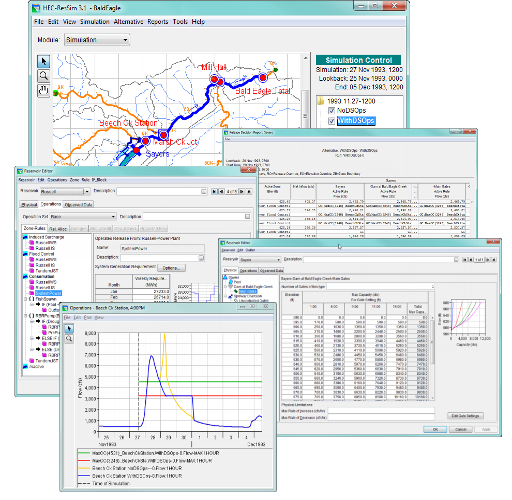
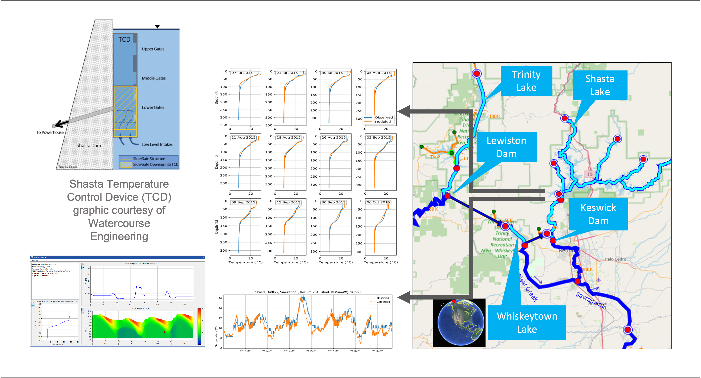
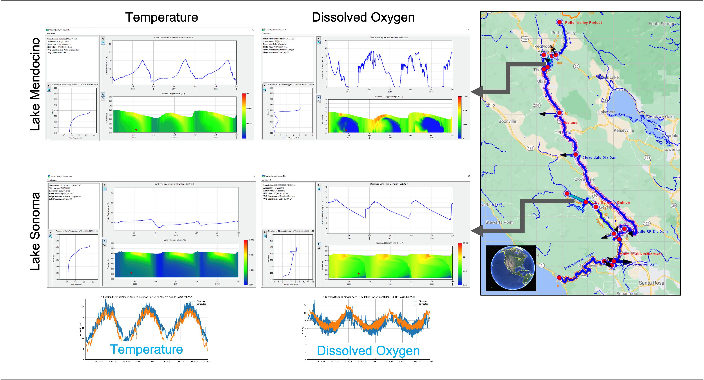

# HEC-ResSim Water Quality Model

The U.S. Army Corps of Engineers Reservoir System Simulation (HEC-ResSim) computer software Version 4.0 was developed by the Hydrologic Engineering Center (HEC) and the U.S. Army Engineer Research and Development Center's Environmental Laboratory (ERDC-EL) in collaboration with Resource Management Associates (RMA) and Portland State University (PSU).

The HEC-ResSim water quality Graphical User Interface (GUI) allows users to:

1. Define met stations and their data sets
2. Select modeled water quality constituents
3. Define water quality parameter methods and values
4. Define the computational grid (e.g., bathymetry)
5. Specify initial and boundary conditions
6. Define observed water quality stations and their data sets
7. Visualize and analyze model outputs using plots and reports

The GUI enables users to create rules that allow water quality objectives and/or constraints to be included with other operating objectives in the HEC-ResSim reservoir release decision process. Reservoir elements use a one-dimensional (1D) vertical transport scheme, representing each reservoir as a vertical set of well-mixed horizontal layers. The connecting riverine reach elements use a 1D horizontal transport scheme in the longitudinal (downstream) dimension, representing each hydrologic reach as a series of well-mixed segments.

The water quality engine calculates the transport and transformation of the water quality constituents. Transport is calculated by numerically solving the advection-diffusion-reaction equation on a discretized version of the watershed geometry. Transformations are calculated using USACE, Engineer Research and Development Center (ERDC), water quality libraries.

Water quality computations are fully integrated in the HEC-ResSim software. This enables water quality objectives to be incorporated in the reservoir release decision process. During a water quality simulation, data will be exchanged between the water quality engine, water quality libraries, and the HEC-ResSim user interface and decision engine.

Figure 1. HEC-ResSim program and user interface.

Figure 2. Representation of one-dimensional (1D) reservoirs in HEC-ResSim-WQ.

Figure 3. Representation of one-dimensional (1D) river reaches in HEC-ResSim-WQ.

Figure 4. HEC-ResSim Water Quality user interface.

Figure 5. HEC-ResSim-WQ model of the Upper Sacramento River.

Figure 6. HEC-ResSim-WQ model of the Russian River.
